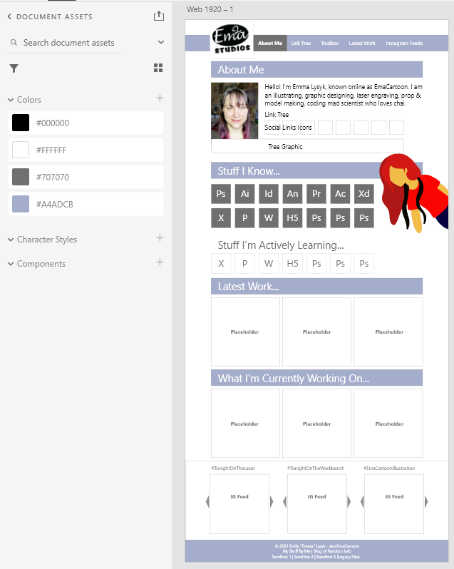

# EmaCartoon Portfolio Project

A portfolio of work is a collection of my best work that can showcase my skills and talents, as well as the thought processes behind it, to employers looking to fill a part-time or full-time position. 

**Note:** As I am just starting to build my portfolio body of projects, there will be some placeholder images and names that I will switch out later on in my course. This note will be removed when I have updated my portfolio.

## Link

[https://emacartoon.github.io/EmaCartoon-Portfolio/index.html](https://emacartoon.github.io/EmaCartoon-Portfolio/index.html)

## Motivation / Project Criteria

**Source:** Bootcamp documentation and is © 2021 Trilogy Education Services, LLC, a 2U, Inc. brand. Confidential and Proprietary. All Rights Reserved.

AS A potential employee I WANT to have a potential employer view my deployed portfolio of work samples SO THAT they can review samples of my work and assess whether I'm a good candidate for their open position.

GIVEN I need to sample a potential employee's previous work
WHEN I load their portfolio
[x] THEN I am presented with the developer's name, a recent photo, and links to sections about them, their work, and how to contact them
WHEN I click one of the links in the navigation
[] THEN the UI scrolls to the corresponding section
WHEN I click on the link to the section about their work
[] THEN the UI scrolls to a section with titled images of the developer's applications
WHEN I am presented with the developer's first application
[] THEN that application's image should be larger in size than the others
WHEN I click on the images of the applications
[] THEN I am taken to that deployed application
WHEN I resize the page or view the site on various screens and devices
[] THEN I am presented with a responsive layout that adapts to my viewport

## Approach
This project utilizes a combination of HTML5, CSS3, Media Queries, and Flaxbox variables to achieve a webpage that will allow a potential employer view my work and get an idea of my capabilities, as well as find and contact me.

## Technology Used

CSS Flexbox framework, Google Fonts, and HTML 5.

## Mockup

Created in Adobe XD

## Credits
Social Media Circle icons are free to use and provided by [IconFinder.com](https://www.iconfinder.com/iconsets/social-media-circle-7)

HTML 5 and CSS 3 logo icons are free to use and provided by [w3.org](https://www.w3.org/html/logo/)

## Grading Requirements

This homework is graded based on the following criteria: 

### Technical Acceptance Criteria: 40%

* Satisfies all of the above acceptance criteria.

### Deployment: 32%

* Application deployed at live URL.

* Application loads with no errors.

* Application GitHub URL submitted.

* GitHub repository contains application code.

### Application Quality: 15%

* Application resembles the mock-up functionality provided in the homework instructions.

### Repository Quality: 13%

* Repository has a unique name.

* Repository follows best practices for file structure and naming conventions.

* Repository follows best practices for class/id naming conventions, indentation, quality comments, etc.

* Repository contains multiple descriptive commit messages.

* Repository contains quality readme with description, screenshot, link to deployed application.

## Review

You are required to submit BOTH of the following for review:

* The URL of the deployed application.

* The URL of the GitHub repository that contains your code. Give the repository a unique name and include a README file that describes the project.